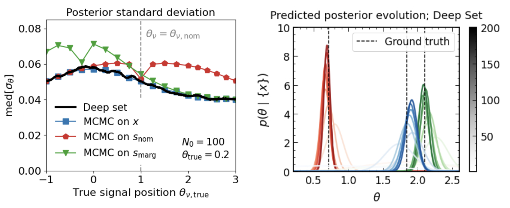
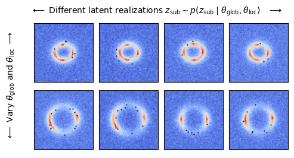

# Hierarchical Neural Simulation-Based Inference Over Event Ensembles

Lukas Heinrich, Siddharth Mishra-Sharma, Chris Pollard, and Philipp Windischhofer

[](https://opensource.org/licenses/MIT)
[](https://arxiv.org/abs/2306.12584)



## Abstract

When analyzing real-world data it is common to work with event ensembles, which comprise sets of observations that collectively constrain the parameters of an underlying model of interest. Such models often have a hierarchical structure, where "local" parameters impact individual events and "global" parameters influence the entire dataset. We introduce practical approaches for optimal dataset-wide probabilistic inference in cases where the likelihood is intractable, but simulations can be realized via forward modeling. We construct neural estimators for the likelihood(-ratio) or posterior and show that explicitly accounting for the model's hierarchical structure can lead to tighter parameter constraints. We ground our discussion using case studies from the physical sciences, focusing on examples from particle physics (particle collider data) and astrophysics (strong gravitational lensing observations).

## Code

Details for each experiment is given below.

### 1. Simple multi-variate normal likelihood

The notebook `notebooks/01_mvn_conjugate_prior.ipynb` can be used to run this experiment in a self-contained manner. The codes `models/deep_set.py` and `models/transformer.py` contain auxiliary code to define the models used.

### 2. Mixture models in particle physics: Bayesian inference for a narrow resonance

To reproduce Fig. 3 (left): run `notebooks/11_bump_hunt_plots.ipynb`

To reproduce Fig. 3 (center, right): The below instructions assume access to a `condor` batch system supporting `singularity`.

* Setup `singularity` images:
```
singularity build /path/to/pytorch.sif notebooks/pytorch_batch/pytorch.def
singularity build /path/to/pymc.sif notebooks/pymc_batch/pymc.def
```
* Setup environment:
```
source setup.sh
```
* Run MCMC campaign: run `notebooks/pymc_batch/RunMCMCCampaign.py --campaigndir path/to/MCMC/campaign --imagepath path/to/pymc.sif`
* Run deep set training: `notebooks/pytorch_batch/RunTrainingCampaign.py --campaigndir path/to/training/campaign --imagepath `path/to/pytorch.sif`
* Make comparison plots: Update paths to MCMC and training campaign directories and run `notebooks/10_MCMC_deepset_comparison.ipynb`

### 3. Astrophysics example: Strong gravitational lensing

The notebook `notebooks/05_lensing.ipynb` can be used to run this experiment in a self-contained manner. The notebook runs simulations of 
lensing images drawn from the forward model, implements the hierarchical deep set for learning global and local parameters simultaneously, and performs inference over local and global parameters. `notebooks/12_lensing_image.ipynb` was used to produce the lensing illustrations.



### 4. Mixture models in particle physics: frequentist treatment

The notebook `notebooks/04_FrequentistTrain.ipynb` can be used to run train the deepset network used for learning a frequentist test statistic. The model is implemented in `models/deep_set_freq.py`.

## Citation

```
@article{heinrich2023hierarchical,
  title={Hierarchical Neural Simulation-Based Inference Over Event Ensembles},
  author={Heinrich, Lukas and Mishra-Sharma, Siddharth and Pollard, Chris and Windischhofer, Philipp},
  journal={arXiv preprint arXiv:2306.12584},
  year={2023}
}
```